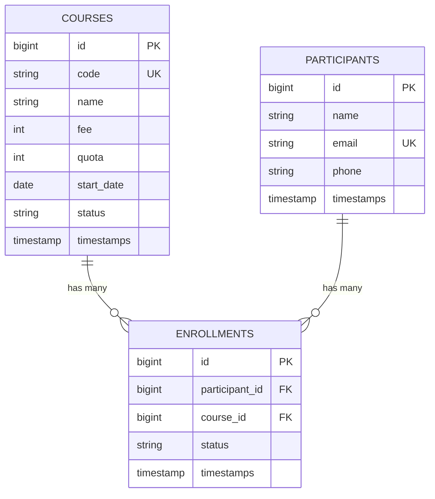

```mermaid
erDiagram
    COURSES ||--o{ ENROLLMENTS : "has many"
    PARTICIPANTS ||--o{ ENROLLMENTS : "has many"

    COURSES {
        bigint id PK
        string code UK
        string name
        int fee
        int quota
        date start_date
        string status
        timestamp timestamps
    }
    PARTICIPANTS {
        bigint id PK
        string name
        string email UK
        string phone
        timestamp timestamps
    }
    ENROLLMENTS {
        bigint id PK
        bigint participant_id FK
        bigint course_id FK
        string status
        timestamp timestamps
    }
```